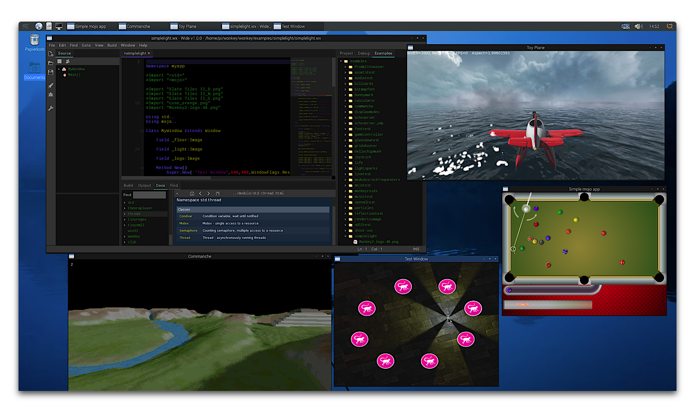

<!---->
<!--- [](https://travis-ci.org/wonkey-coders/wonkey) --->

<div align="center">
	<h1>Wonkey</h1>
	<p><strong>Wonkey</strong> is a easy to learn, oriented object, modern and cross-platform programming language for creating cross-platform video games, highly inspired by the “BlitzBasic” range of languages.</p>
	
</div>

## Desktop targets

| Windows                                | MacOS                                | Linux                                | Raspbian                                 |
| -------------------------------------- | ------------------------------------ | ------------------------------------ | ---------------------------------------- |
|  |  |  |  |

## Mobile targets

| Android                                | iOS                                  |
| -------------------------------------- | ------------------------------------ |
|  |  |

## Web targets

| Emscripten                                                   |
| ------------------------------------------------------------ |
|  |

## More information

 Website: https://wonkey-coders.github.io/

 Github page: https://github.com/wonkey-coders

 Discord channel : https://discord.gg/awfuRtZay7

**Join the community and improve this programming language.**

Enjoy!

## Showcase

**Wonkey on Raspbian (Raspberry PI 4)**


**Click screenshots to run the examples in browser:**

[](https://wonkey-coders.github.io/examples/pool/)

[](https://wonkey-coders.github.io/examples/toy_plane/)

[](https://wonkey-coders.github.io/examples/commanche/)

----
## How to setup Wonkey

### Prerequisites

You need a working C/C++ developement environment for desktop targets, Emscripten for web target. Android NDK for mobile target.

Targets:
- [Windows](#windows)
	- [Using GCC](#using-gcc)
	- [Using MSVC](#using-msvc)
- [MacOS/Linux/Raspberry Pi](#macoslinux)
- [Emscripten](#emscripten)
- [Android](#android)

If you are reading this on Github, please note there are prebuilt versions of wonkey (with complete source code) available from https://github.com/wonkey-coders/wonkey/releases.

### Windows

#### Using GCC

Unless you are using one of the prebuilt releases, you will need to install the mingw-64 compiler. There are self-extracting archive of mingw-64 that has been tested with wonkey here :

* x86 : [i686-6.2.0-release-posix-dwarf-rt_v5-rev1.7z](https://downloads.sourceforge.net/project/mingw-w64/Toolchains%20targetting%20Win32/Personal%20Builds/mingw-builds/6.2.0/threads-posix/dwarf/i686-6.2.0-release-posix-dwarf-rt_v5-rev1.7z)
* x64 : [x86_64-8.1.0-release-posix-seh-rt_v6-rev0.7z](https://downloads.sourceforge.net/project/mingw-w64/Toolchains%20targetting%20Win64/Personal%20Builds/mingw-builds/8.1.0/threads-posix/seh/x86_64-8.1.0-release-posix-seh-rt_v6-rev0.7z)

If you install this to the wonkey 'devtools' directory, the following steps should 'just work' (ha!) else you must added `mingw64\bin` path in your environment variables.

*NOTE: Wonkey use x64 by default. See `bin\windows\env_windows.txt` file for more information.*

#### Using MSVC

Wonkey auto-detected your MSVC installation and use it by default, no need to changes anymore.
If you want using `GCC`, you need to change `WX_USE_MSVC` variable in `bin\windows\env_windows.txt`.

Follow the next steps to build :
1. Open a command prompt and change to the 'wonkey\scripts' directory.
2. Enter `rebuildall.bat` and hit return. Wait...
3. If all went well, you should end up with a 'Wonkey (windows)' exe in the wonkey directory. Run this to launch the WIDE (Wonkey IDE).
4. You should now be able to build and run wonkey apps. There are some sample apps in the 'wonkey/examples' directory.

### MacOS/Linux/Raspberry Pi

* On **MacOS**, install the XCode command line tools. You can do this by entering in a shell :

	* ```shell
		xcode-select --install
		```
		
		Additionally you need to install the ncurses package:

		1.) Using [Homebrew](https://brew.sh/):

		```shell
		brew install ncurses
		```

		See [https://formulae.brew.sh/formula/ncurses](https://formulae.brew.sh/formula/ncurses#default)

		2.) If you like a visual package manager for Homebrew, use [Cakebrew](https://www.cakebrew.com/)


* On **Linux**, install the GCC toolchain and libraries. You can do this by entering in a shell :

	* ```shell
		sudo apt-get install g++-multilib libopenal-dev libpulse-dev libsdl2-dev ncurses-dev
		```

	* You may want to use the following install script as an example:
		
		```shell
		#
		# Install Wonkey on Linux Mint (https://linuxmint.com) into %USER%/wonkey
		#
		cd ~/
		sudo apt-get update
		sudo apt-get install git g++-multilib libopenal-dev libpulse-dev libsdl2-dev
		git clone -b develop --single-branch --depth 1 https://github.com/wonkey-coders/wonkey
		cd wonkey/scripts
		./rebuildall.sh
		cd ..
		./bin/linux/wide/wide
		```

* On **Raspberry Pi OS**, install the GCC toolchain and libraries. You can do this by entering in a shell :

	* ```shell
		sudo apt-get install git libopenal-dev libpulse-dev libsdl2-dev libncurses5-dev libncursesw5-dev libasound2-dev libudev-dev libxi-dev libxxf86vm-dev mesa-common-dev
		```
	
	* You may want to use the following install script as an example:
		
		```shell
		#
		# Install Wonkey on Raspberry Pi 4 into %USER%/wonkey
		#
		cd ~/
		sudo apt-get update
		sudo apt-get install git libopenal-dev libpulse-dev libsdl2-dev libncurses5-dev libncursesw5-dev libasound2-dev libudev-dev libxi-dev libxxf86vm-dev mesa-common-dev
		git clone -b develop --single-branch --depth 1 https://github.com/wonkey-coders/wonkey
		cd wonkey/scripts
		./rebuildall.sh
		```

Follow the next steps to build :

1. Open a shell and change to the 'wonkey/scripts' directory.

2. Enter `./rebuildall.sh` and hit return. Wait...

3. If all went well, you should end up with a 'Wonkey (...)' app in the wonkey directory. Run this to launch the WIDE (Wonkey IDE).

4. You should now be able to build and run wonkey apps. There are some sample apps in the 'wonkey/examples' directory.

----

## Emscripten

See [installation instructions](https://emscripten.org/docs/getting_started/downloads.html) from Emscripten site.

```bash
# Get the emsdk repo
git clone https://github.com/emscripten-core/emsdk.git

# Enter that directory
cd emsdk

# Fetch the latest version of the emsdk (not needed the first time you clone)
git pull

# Download and install the latest SDK tools.
./emsdk install latest

# Make the "latest" SDK "active" for the current user. (writes .emscripten file)
./emsdk activate latest

# Activate PATH and other environment variables in the current terminal
source ./emsdk_env.sh

#In the description above we asked the emsdk to install and activate latest, which is the latest tagged release. That is often what you want.

# You can also install a specific version by specifying it, for example,
./emsdk install 1.38.45

```

*NOTE: on macOS, you can use `brew install emscripten`.*

*NOTE: on Windows, run `emsdk` instead of `./emsdk`, and `emsdk_env.bat` instead of `source ./emsdk_env.sh`.*

Before setup, you need to build modules for web target from `wake` command:
```shell
wake mods -target=emscripten
```

## iOS

You must setup [MacOS](#macoslinux) environment first and you need build modules for iOS target from `wake` command:
```shell
wake mods -target=ios
```
## Android

_TODO_

```shell
wake mods -target=android
```

----

## Introduction to Wonkey

ℹ️ More complete help and samples are available online at https://wonkey-coders.github.io/.

### "Hello, Wonkey!'

```monkey
function main()
  print "Hello, Wonkey!"
end
```

While staying true to the 'basic' style of the original Blitz languages, Wonkey offers some very powerful new features including:

### Generic classes and methods 

Classes, interfaces, structs, methods and functions can have 'type' parameters.

```monkey
struct Rect<T>
  field x0:T, y0:T
  field x1:T, y1:T
end

'Main entry
function main()
  local r:=new Rect<Float>
end
```

### 'First class' functions

Functions (and methods) can be stored in variables and passed to/from other functions.

```monkey
function Test1()
  print "Test1"
end

function Test2()
  print "Test2"
end

function Tester( test:void() )
  test()
end

'Main entry
function main()
  Tester( Test1 )
  Tester( Test2 )
end
```

### Lambda functions

Lambda functions allow you to create closures.

```monkey
function Test( func:Void() )
  func()
end

'Main entry
function main()
  for local i:=0 until 10
    Test( lambda()
      print i
    end)
  next
end
```

### New 'Struct' type that provides value semantics

Structs are similar to classes in that they encapsulate member data, but differ in that they are passed around 'by value' instead of 'by reference'.

This allows structs to be efficiently create on the stack without any garbage collection overhead.

```monkey
struct S
  field data:Int=10
end

function Test( s:S )
  s.data = 100
end

'Main entry
function main()
  local s:=new S 'Create a new S on the stack (very fast!)
  Test( s )      'Test gets a copy of 's'
  print s.data   'Print '10'
end
```

### Fibers for easy asynchronous programming

Fibers provide support for 'cooperative' multi-threading.

```monkey
function Server( host:String, service:String )
  local server:=Socket.Listen( host, service )
	
  repeat
    local client:=server.Accept()
    new Fiber( lambda()
      local data:=client.Receive(...)
    end )
  forever
end
```

### Operator overloading

Operator overloading allows you to override the meaning of the built-in language operators, making for more expressive code.

```monkey
struct Vec2
  field x:Float
  field y:Float

  method new( x:Float,y:Float )
    self.x=x
    self.y=y
  end

  operator+:Vec2( v:Vec2 )
    return new Vec2( x+v.x,y+v.y )
  end

  operator to:String()
    return "Vec2("+x+","+y+")"
  end
end

'Main entry
function main()
  local v0:=new Vec2( 10,20 )
  local v1:=new Vec2( 30,40 )
   
  print v0+v1
end
```

### Class extensions

Class extensions allow you to add extra methods, functions and properties to existing classes.

```monkey
struct Foo
  field i:Int=0
end 
```

```monkey

struct Foo extension
  method Increment()
    i+=1
  end
end
```

### Fully garbage collected

Wonkey provides a 'mostly' incremental garbage collector that efficiently collects garbage as it runs without any of those annoying 'sweep' spikes found in typical garbage collectors.

### Optional reflection features

Wonkey includes an optional reflection system that allows you to inspect and modify variables and values at runtime:

```monkey
#import <reflection>

class C
  method Update( msg:String )
    print "C.Update : msg=" + msg
  end
end

'Main entry
function main()
  local c:=new C
	
  local type:=typeof( c )
  print type
	
  local decl:=type.GetDecl( "Update" )
  decl.Invoke( c, "Hello World!" )
end

```

### Credits

Wonkey is an community project and an fork of Monkey2 programming language designed by Mark Sibly, creator of the 'Blitz' range of languages.
